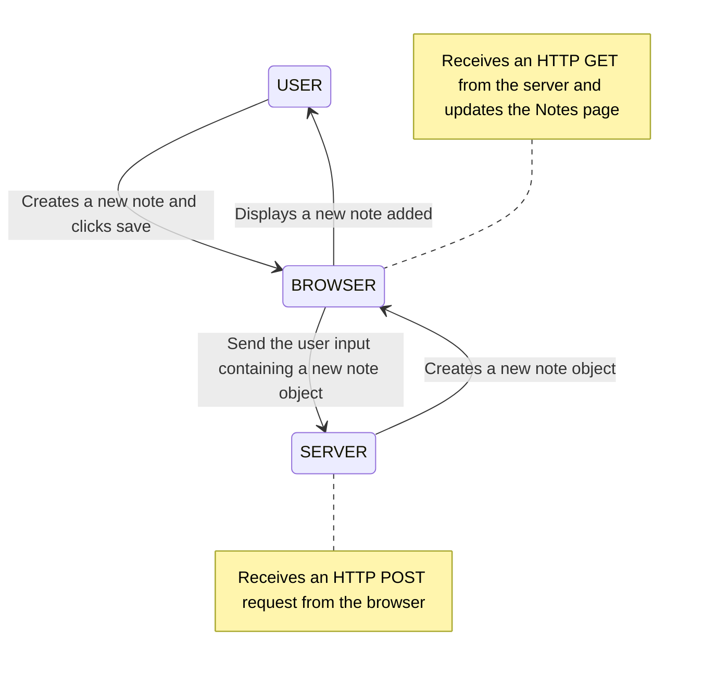

```mermaid
   stateDiagram-v2
        USER --> BROWSER: Creates a new note and clicks save
        BROWSER --> SERVER: Send the user input containing a new note object
            Note left of BROWSER: Receives an HTTP GET from the server and updates the Notes page
        SERVER --> BROWSER: Creates a new note object
            Note right of SERVER: Receives an HTTP POST request from the browser
        BROWSER --> USER: Displays a new note added
```
